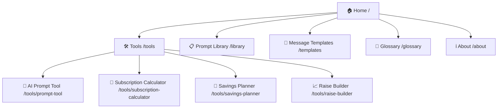
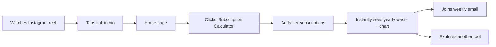
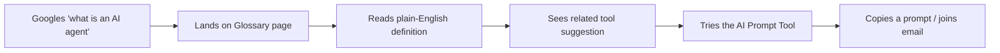
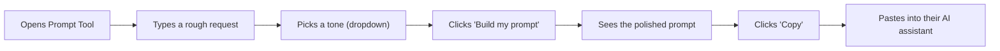

# Phase 3 — Information Architecture (IA)
### The Leverage Report — Web App

> **Information Architecture** = deciding *what pages exist* and *how they connect*, before
> designing how anything looks. It has two parts: a **Sitemap** (a map of all the pages) and
> **User Flows** (the step-by-step path a visitor takes to get something done). Getting this
> right means people never feel lost. Recruiters ask "how did you structure the app?" — this
> is the answer. The diagrams below render automatically on GitHub. Portfolio artifact.

**Status:** ✅ FINAL — approved by user 2026-07-25.
**Date:** 2026-07-25

---

## PART A — Sitemap (all the pages)

**Recommended approach: a multi-page site** (each tool/section is its own page/URL), NOT one
long scrolling page. *Why:* (1) each tool gets a shareable link you can drop in a reel,
(2) the Glossary pages get found on Google (SEO), (3) it shows real routing skill — a stronger
engineering signal. This is my advisor recommendation; see ⚠️ below if you'd prefer simpler.

**Global (on every page):**
- **Top navigation bar:** Logo · Tools · Library · Templates · Glossary
- **Footer:** ✉️ weekly-email signup · Instagram link (@the.leverage.report) · quick links

**Page purposes at a glance**
| Page | Purpose |
|---|---|
| Home | Explain the brand in one line + send visitors to the right tool fast |
| Tools (index) | List the 4 interactive tools with a one-line description each |
| 4 tool pages | Each does its one job (input → answer) |
| Prompt Library | Searchable grid of tested prompts to copy |
| Message Templates | Ready-made scripts (raise, bill, outreach) to copy |
| Glossary | Plain-English AI term definitions (also SEO entry points) |
| About | Short, honest brand story (anonymous — no personal info) |

---

## PART B — User Flows (the paths visitors take)

> A user flow shows the *steps* someone takes to reach a goal. We design the site around these
> real journeys so nothing gets in their way. Here are the 3 most important.

### Flow 1 — Emma saves money (primary journey)

### Flow 2 — Ryan learns a term, then explores (SEO / discovery journey)

### Flow 3 — Using the AI Prompt Tool (core interaction)

---

## PART C — IA principles (these guide the design)
1. **Home is a launchpad, not a wall of text** — get people to the right tool in one click.
2. **Every tool is reachable in ≤2 clicks** from anywhere (via the top nav).
3. **No dead ends** — after a result, always offer a next step (another tool or email signup).
4. **Consistent nav + footer** on every page so visitors never feel lost.
5. **Each page = one clear job** (matches the "speed to value" takeaway from Phase 2).

---
### ✅ Phase 3 sign-off (2026-07-25)
1. **Multi-page** approach — ✅ approved.
2. **Page list** — ✅ approved. **About page kept** as a short, *anonymous* brand-story page
   (no personal info) — it reinforces the "trust through honesty" takeaway from Phase 2.
3. **3 user flows** — ✅ approved.

### ➕ New global requirement added this session: Motion & Interactivity
The user asked for an interactive, animated site. Captured as a project-wide requirement
(see PROJECT.md section 10). Detailed motion spec will be defined in **Phase 5 (Design System)**
and implemented in **Phase 9 (Development)** using **Framer Motion**. Principle: purposeful,
tasteful motion only; must stay fast; honor `prefers-reduced-motion` for accessibility.
